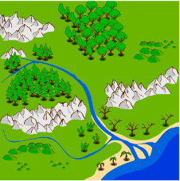
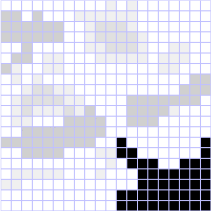
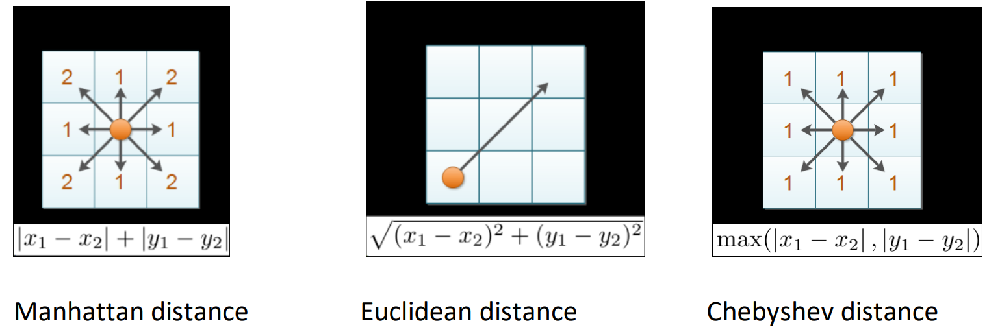
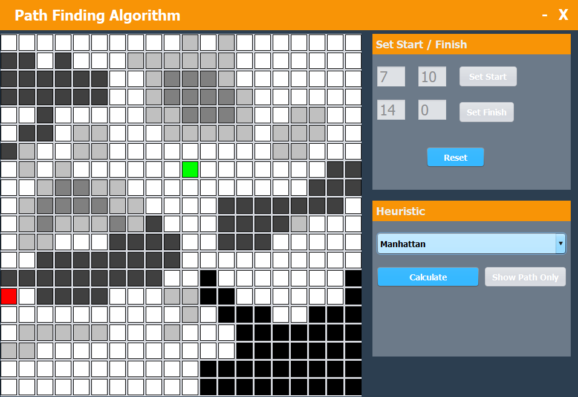
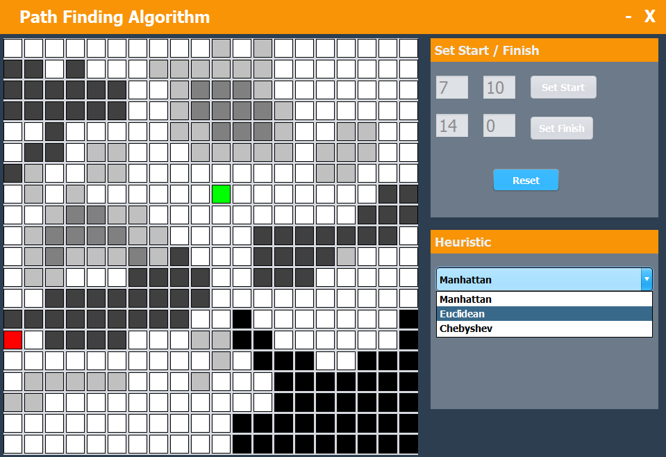
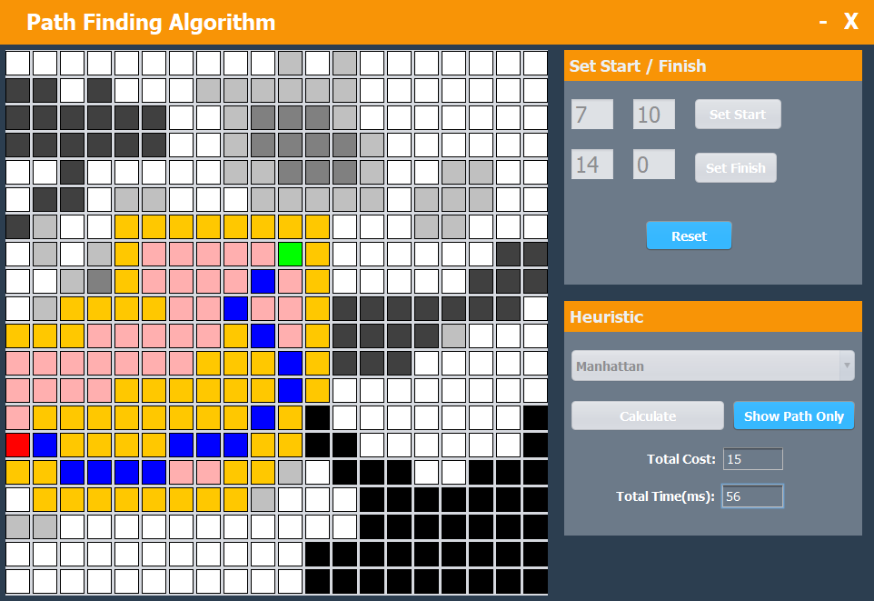
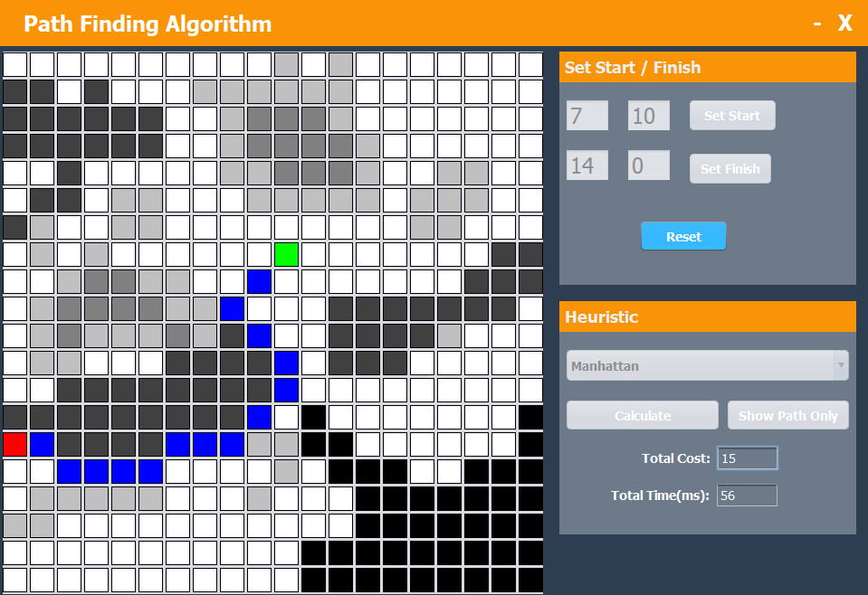

# Shortest Path Algorithm

I've completed this project as a module coursework in my second year at University. 

The task was achieved using <b>Java</b> and the <b>A* Algorithm</b>.
I've implemented the grid based data strucutre reflecting exactly the one depicted in the problem description below. 

## Problem Description: 

Design, implement and analyse the performance in terms of the following heuristics, i.e., Euclidean, Manhattan and Chebychev, based on the shortest path finding algorithem between to arbitrarily chosen points A (start) and B (end).

  

The image on the left depicts the background of a landscape, whereas the image on the right illustrates the landscape underpinning grid. The grid is a two-dimensional array, upon which the algorithm will operate. 

The following assumptions will have to hold: 
1. All white cells, apart from the black ones, are viable;
2. All adjacent cells can be visited by moving diagonally, vertically, or horizontally; 
3. The cost of visiting a cell is dictated by the chosen heuristic as well as the four different shades of grey;
    - White = 1 
    - Lightest shade of grey = 2
    - Middle shade of grey = 3
    - Darkest shade of grey = 4
4. The definitions of the three distance metrics being used as heuristics as shown below;

## Features

The applications enables user to:
- Visualise the generated squared grid
- User can click on the grid and set the Start and End points accordingly. 
- Select the heuristic from the options available
- Visualise the total cost and time taken for the shortest path

 
 
